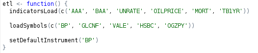
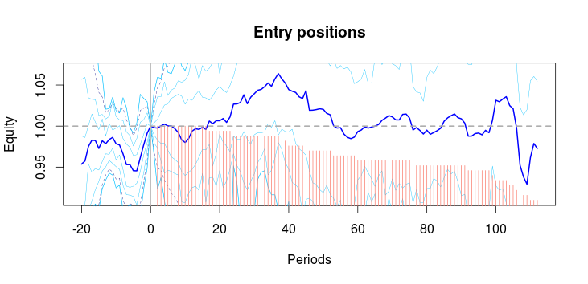
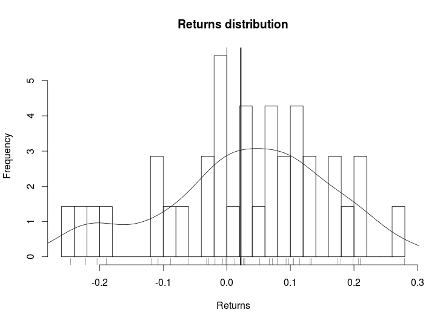
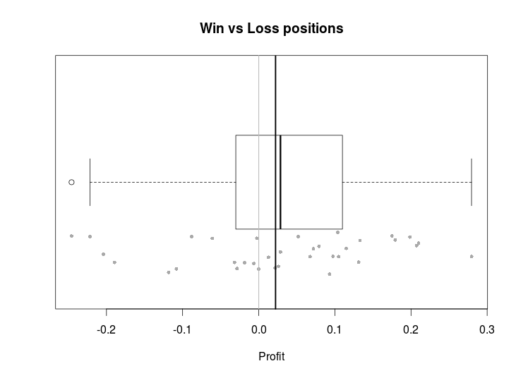
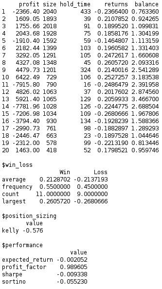
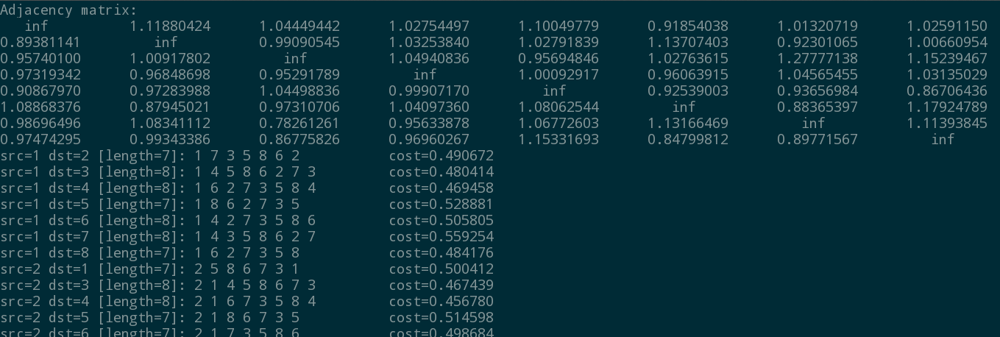
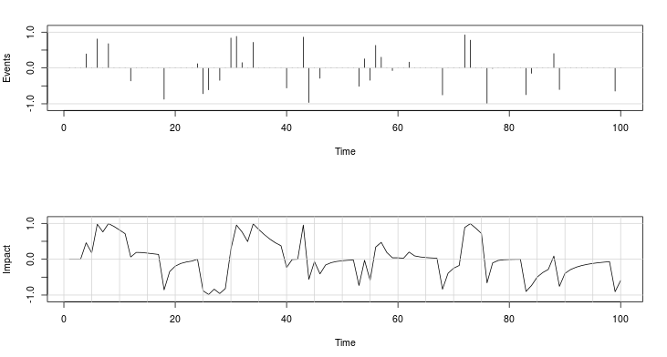
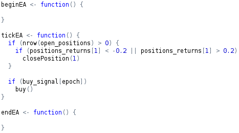

__Clarity__ is a framework for quickly and professionally R&D new strategies
for equities and derivatives.

It is built on top of the powerful _R_ programming language, providing bindings
to _C_, _C++_ and the popular databases.

Beyond _R_'s standard functionalities (basic statistics, time series,
statistical mechanics, chaos, etc), __Clarity__ proposal offers a
handful of possibilities to leverage algotraders from portfolio theory to
arbitrage to high frequency trading.

#### ETL equities and derivatives

Indicators and instruments are available for pre-loading and pre-calculation.
Simulations can involve multiple instruments, either equities or derivatives, as well as multiple indicators, either pre-calculated or calculated _on-the-fly_.

#### Event profiler

Track position evolution throughout the trades and diagnose what are their behaviour.

### Reporting and journaling

#### Position sizing

Position sizing is an important part in scaling the trading strategy and there are optimal ways to calculate the right amount for each strategy. Widely known position sizing methods are Kelly criteria and Optimal/Fractional/Secure F.

#### Position management

Act according to the position evolution using the basic or more elaborate techniques to cap risks.

* Stop Loss
* Take Profit
* Trailing stop and dynamic trailing stop.

#### Links to other technologies

* Langauges: _C_, _C++_. 
* Data providers: _Quandl_. 
* Databases: _Postgresql_, _MySQL_, _MariaDB_, etc. 
* Further links will include _S-plus_, _Matlab_, and _Mathematica_.

#### Arbitrage spot

Comes with an extended triangular arbitrage module to latent arbitrage opportunities.

#### Impact aggregator

Facing either same or opposite directions, an one-axis view over events at different impact levels plays in important role on strategy's success.

#### Every tick

Alike _MetaTrader_, the well known tool for retail traders, __Clarity__ bundles the standard loop `begin()`-`start()`-`end()`.

Parameter optimisation can be performed using genetic algorithms, simulated annealing, and a few others depending on parameters restrictions.
