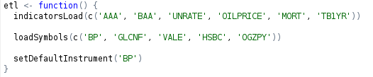
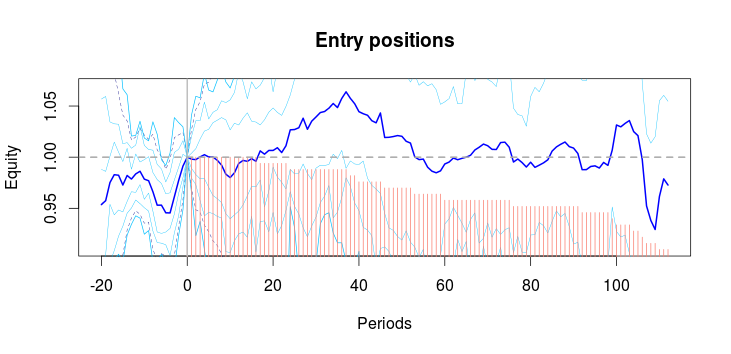
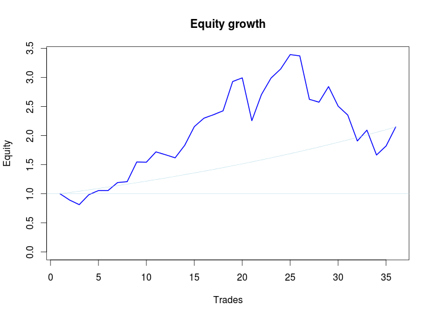
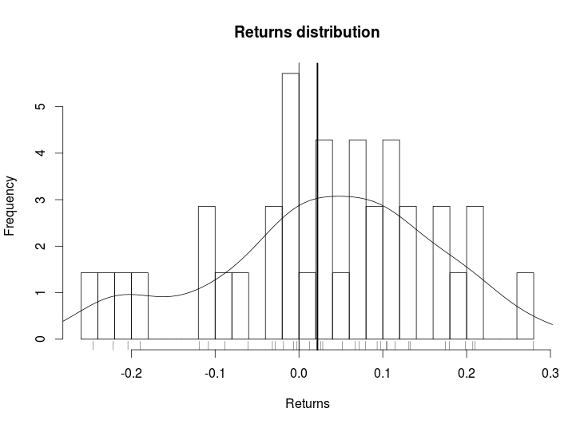
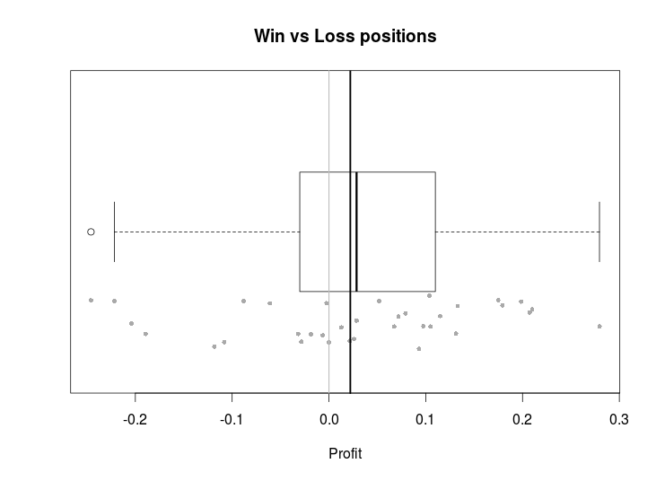
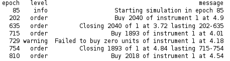
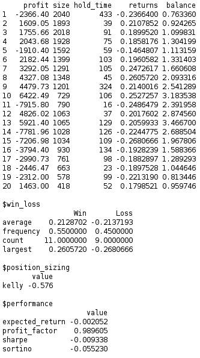
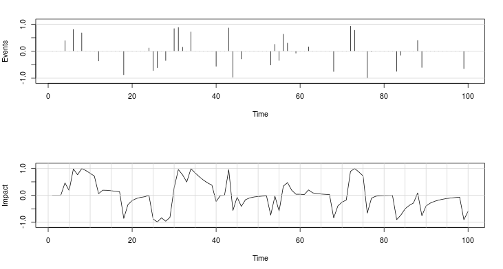
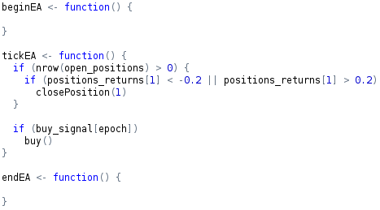

__Clarity__ is a framework for quickly and professionally R&D new strategies
for equities and derivatives.

It is built on top of the powerful _R_ programming language, providing bindings
to _C_, _C++_ as well as the most popular databases.

Beyond _R_'s standard functionalities (basic statistics, time series,
statistical mechanics, chaos, etc), __Clarity__ proposal offers a
handful of possibilities to leverage algotraders from portfolio theory to
arbitrage to high frequency trading.

#### ETL equities and derivatives

Indicators and instruments are available for pre-loading and pre-calculation.
Simulations can involve multiple instruments, either equities or derivatives, as well as multiple indicators, either pre-calculated or calculated _on-the-fly_.



#### Event profiler

Track position evolution throughout the trades and diagnose what are their behaviour.



### Reporting and journaling







All backend events are tracked in journaling. Journaling is a simplex channel to the frontend serving as a communication tool informing different notification levels, from warnings to errors.



Further applications include abnormality detection and error correction & recovery.

#### Position sizing

Position sizing is an important part in scaling the trading strategy and there are optimal ways to calculate the right amount for each strategy. Widely known position sizing methods are Kelly criteria and Optimal/Fractional/Secure F.



#### Position management

Act according to the position evolution using the basic or more elaborate techniques to cap risks.

* Stop Loss
* Take Profit
* Trailing stop and dynamic trailing stop.

#### Links to other technologies

* Languages: _C_, _C++_. 
* Data providers: _Quandl_. 
* Databases: _Postgresql_ and all databases supported through DBI.
* Platforms: _Matlab_.

Further links will include _S-plus_, _Mathematica_, and _Q_ (Kdb).

#### Arbitrage spot

Comes with an extended triangular arbitrage module to spot latent arbitrage opportunities.


#### Impact aggregator

Facing either same or opposite directions, an one-axis view over events at different impact levels plays in important role on strategy's success.



#### Vectorized- and Iterated-based Simulation

Alike _MetaTrader_, the well known tool for retail traders, __Clarity__ bundles the standard iteration loop `begin()`-`start()`-`end()`, specially useful in HFT, and the traditional vector-based simulation, as in _Matlab_, in one single environment enabling both approaches to be used simultaneously.



Parameter optimisation can be performed using genetic algorithms, simulated annealing, and a few others depending on parameters restrictions.

#### To do list

- Short selling.
- Limit orders.
- Two way queue system: FIFO system, OCO orders
- Stop loss / take profit.
- Transaction costs, commission and spread.
- Slippage simulation according to volatility.
- Order book simulation (FIFO and the other one).
- Append position's return in open\_positions
- Add kelly criteria in reporting result for multi-asset
- Portfolio report
- Rewrite symbols.R
- Amend FRED meta info: http://stackoverflow.com/questions/24985267/quantmod-fred-metadata-in-r
- Embed date into journal
- load\_instruments' trim function

## Installation

Run

```
./setup
```

and follow the given instructions.
